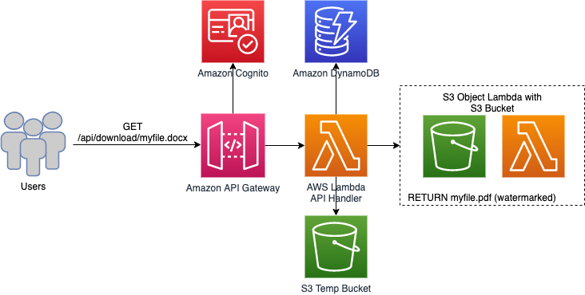

# 📄 Automating Document Conversion & Watermarking with Amazon S3 Object Lambda

> 🛠️ **Tech Stack**: AWS Lambda · S3 Object Lambda · Docker · API Gateway · Cognito · DynamoDB · ECR · CloudWatch

## 🚀 Project Overview

In this project, we build a **serverless, secure, and scalable** document processing system using Amazon Web Services. The goal? Automatically convert uploaded documents to PDF and apply a watermark—all without managing any servers.

This solution integrates:

- ✅ **Amazon S3 Object Lambda** for document transformation
- 🔐 **Amazon Cognito** for secure user authentication
- 🧠 **AWS Lambda** (with Docker) for executing conversions
- 🗃️ **DynamoDB** for metadata storage
- 📡 **API Gateway** for exposing secure RESTful APIs
- 🐳 **Docker & ECR** for packaging and deploying LibreOffice

---

## 📚 What You'll Learn

- How to build a **document transformation pipeline** using S3 Object Lambda
- Authenticate and secure APIs using **JWT tokens with Cognito**
- Deploy **Dockerized Lambda functions** from AWS ECR
- Implement **secure, scalable architectures** with IAM, logging, and monitoring
- Work with **DynamoDB** for efficient, serverless data storage

---

## 🧩 Architecture Diagram (Optional)

---

## 🏗️ Step-by-Step Implementation

### 🔁 Configure Amazon S3 Object Lambda

1. Go to **S3 > Object Lambda Access Points**
2. Create a new access point and choose your source bucket
3. Attach a Lambda function that will handle transformations (conversion + watermarking)

### 🔧 Set Up the Lambda Transformation Function

- Create a new Lambda function (Node.js or Python)
- Assign the correct IAM role
- Implement logic to:
  - Fetch the original document from S3
  - Convert to PDF and apply a watermark
  - Return the transformed object

> 💡 Tip: Use `console.log()` for debugging via CloudWatch logs

---

## 🔐 Secure the System with Cognito

### 👤 Amazon Cognito User Pool

- Create a **User Pool** with email/password login
- Enable **OAuth 2.0 & JWT**
- Optionally enable MFA

### 🛡️ Secure API Gateway with Cognito

1. Create a **REST API** in API Gateway
2. Add a **Cognito Authorizer** to verify JWTs
3. Require the `Authorization` header for access
4. Associate it with the Lambda methods

---

## 🧬 Build the Backend Logic

### 🗃️ Store Metadata in DynamoDB

- Table: `document_metadata`
- Partition key: `user_id`
- Sort key: `timestamp`
- Enable Point-in-Time Recovery (PITR)

### 🧠 Lambda for Metadata Handling

- Lambda triggered by API Gateway
- Handles:
  - Inserting metadata
  - Retrieving user-specific documents

### 🔐 IAM Policies

- Grant minimal permissions (`least privilege`)
- Example: Only allow a Lambda to `PutItem` in DynamoDB
- Use condition-based access for API Gateway

---

# Developing the Document Conversion Service

## Implementing LibreOffice with AWS Lambda

1. Attempted using Lambda Layer for LibreOffice but encountered compatibility issues with Node.js 20.
2. Switched to using a LibreOffice Lambda base image.

## Deploying the Lambda Base Image with Docker

1. Clone the libreoffice-lambda-base-image repository.
2. Build the Docker image with: docker build -t conversion-app:test --provenance=false

## Authenticating Docker CLI with ECR
1. Set AWS environment variables:
- $env:AWS_ACCESS_KEY_ID = "your-access-key"
- $env:AWS_SECRET_ACCESS_KEY = "your-secret-key"
- $env:AWS_SESSION_TOKEN = "your-session-token"

2. Authenticate with AWS ECR: 
- aws ecr get-login-password --region us-east-1 | docker login --username AWS --password-stdin your-ecr-repo-url

## Pushing Docker Image to AWS ECR

1. Tag the image:
- docker tag conversion-app:test your-ecr-repo-url/conversion-app:latest

2. Push the image to ECR:
- docker push your-ecr-repo-url/conversion-app:latest

## Running Document Conversion in AWS Lambda

1. Deploy the Docker image as a Lambda function.
2. Integrate the function with API Gateway for remote processing.

# Configuring API Gateway with Cognito and Lambda

## Creating the API Gateway Endpoint

1. Open the AWS API Gateway console.
2. Click "Create API" and select "REST API".
3. Choose "Regional" as the endpoint type.
4. Create a new resource and define the path for the API.
5. Add a method (e.g., POST) and integrate it with AWS Lambda.

## Enabling Cognito Authorizer for API Gateway

1. Navigate to the "Authorizers" section in API Gateway.
2. Click "Create Authorizer" and select "Cognito".
3. Choose the previously created Amazon Cognito user pool.
4. Enable "Token Source" and define it as "Authorization" (this expects JWT tokens in the request header).
5. Save the configuration and associate it with the API method.

## Integrating API Gateway with Lambda

1. Ensure "Lambda Proxy Integration" is enabled.
2. In the method request settings, require an authorization token from Cognito.
3. Deploy the API and note the invoke URL.
4. Test the endpoint by making a request with a valid Cognito authentication token.

## API Logging and Security

1. Configure Cognito authentication rules and IAM policies to limit access.
2. Enable API Gateway logging to CloudWatch for debugging authentication issues.

# Testing the S3 Object Lambda Transformation

1. Use the AWS CLI or SDK to retrieve an object through the Object Lambda Access Point.
2. Verify that the document is converted and watermarked as expected.
3. Check CloudWatch logs for debugging any transformation errors.

# Conclusion

This project demonstrates how to leverage AWS services for automated document conversion and watermarking. By implementing security best practices, IAM access control, and automation with Docker and Lambda, we achieve a scalable, secure, and efficient cloud-based solution.
